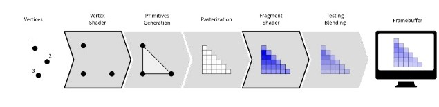

# unity-render-pipelines

**Details**

I created this for my own educational purposes as well as using it for training others in the classroom.

It is a series of small demos. Each shows one design pattern.

Enjoy!

**Render Pipelines**

* **Standard Render Pipeline** - Unity’s Built-in Render Pipeline is Unity’s older render pipeline. It is not based on the Scriptable Render Pipeline. See <a href="https://docs.unity3d.com/2020.2/Documentation/Manual/built-in-render-pipeline.html">built-in-render-pipeline</a> for more.
* **Universal Render Pipeline** - The Universal Render Pipeline (URP) is a prebuilt Scriptable Render Pipeline, made by Unity. URP provides artist-friendly workflows that let you quickly and easily create optimized graphics across a range of platforms, from mobile to high-end consoles and PCs. See <a href="https://docs.unity3d.com/2020.2/Documentation/Manual/universal-render-pipeline.html">universal-render-pipeline</a> for more.
* **High Definition Render Pipeline** - The High Definition Render Pipeline (HDRP) is a prebuilt Scriptable Render Pipeline, built by Unity. HDRP lets you create cutting-edge, high-fidelity graphics for high-end platforms. See <a href="https://docs.unity3d.com/2020.2/Documentation/Manual/high-definition-render-pipeline.html">high-definition-render-pipeline</a> for more.

Created By
=============

- Samuel Asher Rivello 
- Over 20 years XP with game development (2020)
- Over 8 years XP with Unity (2020)

Contact
=============

- Twitter - <a href="https://twitter.com/srivello/">@srivello</a>
- Resume & Portfolio - <a href="http://www.SamuelAsherRivello.com">SamuelAsherRivello.com</a>
- Git - <a href="https://github.com/SamuelAsherRivello/">Github.com/SamuelAsherRivello</a>
- LinkedIn - <a href="https://Linkedin.com/in/SamuelAsherRivello">Linkedin.com/in/SamuelAsherRivello</a> <--- Say Hello! :)
